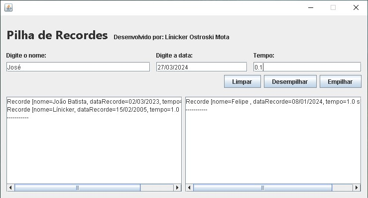

# Programa de Empilhamento e Desempilhamento de Recordes em Java

### Descrição
Este é um programa simples desenvolvido em Java que permite empilhar, desempilhar e limpar recordes. O programa oferece uma interface gráfica básica para interação do usuário, onde é possível visualizar e manipular os recordes.

### Funcionalidades Principais
1. **Empilhamento de Recordes:** O programa permite ao usuário adicionar novos recordes empilhando-os em uma estrutura de dados do tipo pilha.
2. **Desempilhamento de Recordes:** Além de empilhar recordes, o usuário também pode desempilhá-los, retirando-os da pilha.
3. **Limpeza de Recordes:** Existe a funcionalidade de limpar todos os recordes da pilha de uma só vez.
4. **Visualização em TextBox:** Dois TextBox são fornecidos na interface gráfica: um para exibir os recordes empilhados e outro para mostrar os recordes desempilhados.

### Como Executar
Para executar o programa, siga os passos abaixo:
1. Certifique-se de ter o ambiente Java instalado em seu sistema.
2. Compile o código-fonte Java utilizando um compilador Java de sua escolha ou uma IDE compatível.
3. Execute o arquivo compilado, geralmente com extensão `.class`, ou execute diretamente o arquivo JAR, se disponível.

### Dependências
Este programa não possui dependências externas. Todo o código necessário para execução está incluído no próprio arquivo fonte.

### Contribuições
Contribuições são bem-vindas! Sinta-se à vontade para abrir problemas (issues) e enviar solicitações de recebimento (pull requests) para melhorar este projeto.

### Autor
Linicker Ostroski Mota | olinicker@gmail.com

